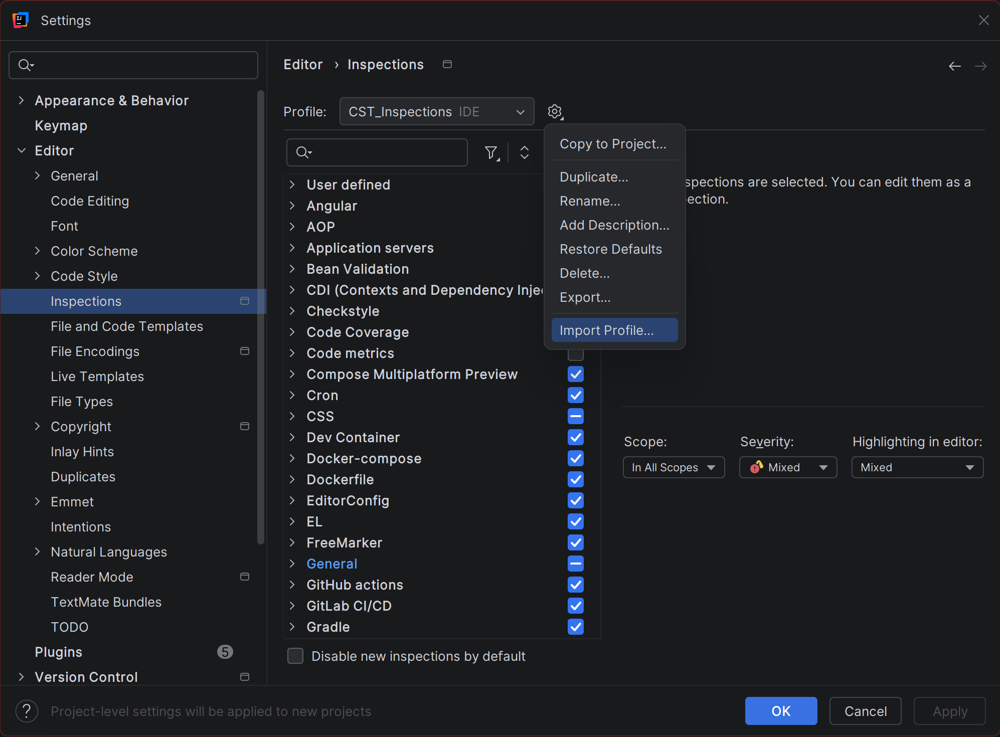

# Configuring Inspections

## Overview

[Code inspections](glossary.md#code-inspection) are IntelliJ IDEA's built-in
real-time code analysis system — think of them as a spell-checker for your code.
As you type, the IDE continuously scans your file and flags potential problems
directly in the editor, without requiring you to compile or run your program.

Inspections catch everything from code that will not compile, to style
violations your instructors will mark against, to subtle logical bugs like
comparing [strings](glossary.md#string) with `==` instead of `.equals()`.
In CST courses, your instructors expect code that conforms to specific style
guidelines, and having the right inspection profile active means you get warned
about violations the moment you write them.

This section explains what inspections are, how to read what they flag, and
how to import a pre-configured inspection profile matched to CST course
requirements.

By the end of this section you will have an inspection profile active
globally across all your IntelliJ IDEA projects.

### Inspections vs. Checkstyle

IntelliJ inspections and [Checkstyle](glossary.md#checkstyle) are two separate
tools that complement each other. Understanding the difference will save you
from submitting code that looks clean in the editor but fails the course
grading tool.

| | IntelliJ Inspections | Checkstyle |
|---|---|---|
| **When it runs** | Continuously, as you type | On demand, from the Checkstyle panel |
| **How it shows issues** | Red and yellow underlines in the editor | A list of violations in the Checkstyle [tool window](glossary.md#tool-window) |
| **What it enforces** | IDE-level code quality and style rules | The exact ruleset your instructor grades against |
| **Configuration** | This inspection profile XML | `COMP-2522-Checkstyle.xml` loaded into CheckStyle-IDEA |

Use inspections to catch issues early while you write. Use Checkstyle as your
final check before every submission — it is the authoritative tool your
instructor runs against your code.

!!! warning
    A clean editor with no underlines does not mean a clean Checkstyle run.
    Always run Checkstyle from the [tool window](glossary.md#tool-window)
    before submitting. See
    [Installing and Configuring Plugins](plugins.md) for setup instructions.

!!! note
    Inspections do not change your code automatically. They identify
    issues and suggest fixes — you decide whether to apply them.

## Understanding Inspection Severity Levels

IntelliJ IDEA uses colour-coded highlights to indicate how serious an
inspection finding is. The [severity](glossary.md#severity) level appears
in the inspection widget in the top-right corner of the editor.

| Colour | Severity | Meaning |
|---|---|---|
| Red underline | Error | Code that will not compile or will cause a runtime exception |
| Yellow underline | Warning | Code that compiles but may behave unexpectedly or violate style rules |
| Grey underline | Weak warning | A minor suggestion, such as a redundant statement |
| Green underline | Typo | A spelling issue in a string or comment |

## What the CST Inspection Profile Checks

The profile provided with this guide covers the following categories, all
drawn directly from the COMP 2522 Style Guide and Checkstyle configuration:

| Category | What it catches | Style Guide rule |
|---|---|---|
| **[Javadoc](glossary.md#javadoc)** | Missing comments on public classes, methods, and fields; missing `@author`, `@version`, `@param`, `@return`, `@throws` tags; empty Javadoc [stubs](glossary.md#stub) | 9, 10, 13, 14 |
| **StringBuilder** | [String](glossary.md#string) concatenation using `+` inside loops; concatenation outside loops where StringBuilder is required | — |
| **Visibility** | Public instance variables; fields that could have more restrictive access; non-final static fields | 11, 12 |
| **Mutability** | Method and constructor parameters not declared `final`; local variables and fields that could be `final` | 18, 19 |
| **Naming** | Constants not in `UPPER_SNAKE_CASE`; classes not in `UpperCamelCase`; methods and variables not in `lowerCamelCase` | — |
| **Imports** | [Wildcard imports](glossary.md#wildcard-import) (`import java.util.*`); unused imports | — |
| **equals/hashCode** | Missing `hashCode()` when `equals()` is overridden; use of `instanceof` inside `equals()` | 24 |
| **Code quality** | [Magic numbers](glossary.md#magic-number); empty catch blocks; catching `Exception`/`Error`; string comparison with `==`; inline ternary operators; duplicate code | 17, 21, 24 |
| **Switch statements** | Missing `default` case; fall-through without `break`/`return`/`throw` | — |
| **Method design** | Methods exceeding 30 lines; more than 7 parameters | 26 |
| **OOP** | Abstract classes with no abstract methods; interfaces used only for constants | 28, 29 |
| **Formatting** | Lines exceeding 100 characters | — |
| **General** | TODO comments; commented-out code blocks | — |

### A Note on StringBuilder

COMP 2522 requires `StringBuilder` for all [string](glossary.md#string)
construction. String concatenation using `+` is not permitted, even outside
of loops.

By default, IntelliJ IDEA includes an inspection called
**"StringBuilder can be replaced with String"** (found under
**Verbose or redundant code constructs** in the Inspections panel)
that suggests converting your `StringBuilder` back to simple concatenation.
The CST inspection profile **disables this inspection** so it does not
contradict course requirements.

The profile keeps the complementary inspection — **"String concatenation
in loop"** — enabled, so you will still be warned if you accidentally use
`+` concatenation inside a loop.

## Viewing Your Active Inspection Profile

1. Open **File > Settings** (++ctrl+alt+s++).

2. In the **Settings** window, navigate to **Editor > Inspections** in
   the left panel.

    At this point, you will see the Inspections panel. The dropdown at the
    top shows your currently active profile. The default is **Project Default**.

3. Click **Cancel** to close without making changes.

## Importing the CST Inspection Profile

!!! warning
    Importing a profile does not delete your existing profiles. You can
    switch between profiles at any time using the dropdown in the
    Inspections panel.

1. Download `CST_Inspections.xml` from the
   [`/resources`](https://github.com/KJAlloway/COMM2216_User_Documentation_Project_KJA_DLN/tree/main/resources)
   folder of this repository. Save it somewhere it will not be
   accidentally deleted — a dedicated folder such as
   `Documents/BCIT/IDE_Config` works well.

2. Open **File > Settings** (++ctrl+alt+s++).

3. In the **Settings** window, navigate to **Editor > Inspections**.

4. In the profile dropdown at the top of the Inspections panel, select
   **IDE** from the scope options to ensure the profile is stored
   globally rather than for a single project.

5. Click the **gear icon** (⚙) at the top of the Inspections panel.

6. Select **Import Profile** from the dropdown.

7. Navigate to the downloaded `CST_Inspections.xml` file and click **Open**.

    At this point, IntelliJ IDEA will ask you to confirm the profile name.
    Keep it as `CST_Inspections` so it is easy to identify later.

8. Click **OK** to confirm.

    At this point, **CST_Inspections** will appear in the profile dropdown
    at IDE scope.

9. Select **CST_Inspections** from the profile dropdown to make it active.

    { alt="Editor > Inspections panel showing the gear icon dropdown open with Import Profile visible, and CST_Inspections selected in the profile dropdown at IDE scope" title="Importing and activating the CST inspection profile" }

## Confirming Global Scope

After selecting **CST_Inspections** in the dropdown, check whether it shows
`CST_Inspections` or `CST_Inspections (Project)` in the dropdown label.

- If it shows **`CST_Inspections`** — the profile is stored in your IDE
  settings and will apply to every project you open. You are done.
- If it shows **`CST_Inspections (Project)`** — the profile is stored in
  the current project only. To fix this:

    1. Click the **gear icon** (⚙) again.
    2. Select **Copy to IDE** from the dropdown.
    3. Confirm the copy. The label will change to `CST_Inspections`
       without the `(Project)` suffix.

## Applying and Saving

!!! note
    If IntelliJ IDEA is still [indexing](glossary.md#indexing) your project
    when you apply the profile — indicated by a progress bar in the
    bottom-right corner of the IDE — wait for indexing to complete before
    proceeding. Applying profile changes during indexing can cause a
    temporary lag and may not highlight all issues immediately.

1. Click **Apply** at the bottom of the Settings window.

2. Click **OK** to close Settings and return to your code.

    At this point, IntelliJ IDEA will re-scan any open files and highlight
    issues according to the CST inspection rules.

## Verifying Your Inspection Profile

Open any `.java` file in your project and look at the inspection widget in
the top-right corner of the editor. If the profile is active, IntelliJ IDEA
is now analysing your code against CST style requirements.

!!! tip
    Press ++alt+enter++ on any highlighted issue to see IntelliJ IDEA's
    suggested fix. This is one of the most useful shortcuts in the IDE —
    it works on errors, warnings, and suggestions alike.

## Conclusion

Your editor is now configured to flag code style issues that match CST
course requirements across every project you open. Any violations will
appear as you type, giving you immediate feedback before you submit
assignments.

Remember that this profile is your early-warning system. Before submitting
any lab or assignment, run the course Checkstyle configuration from the
Checkstyle tool window to confirm your code passes the same checks your
instructor uses. Setup instructions are in
[Installing and Configuring Plugins](plugins.md).
