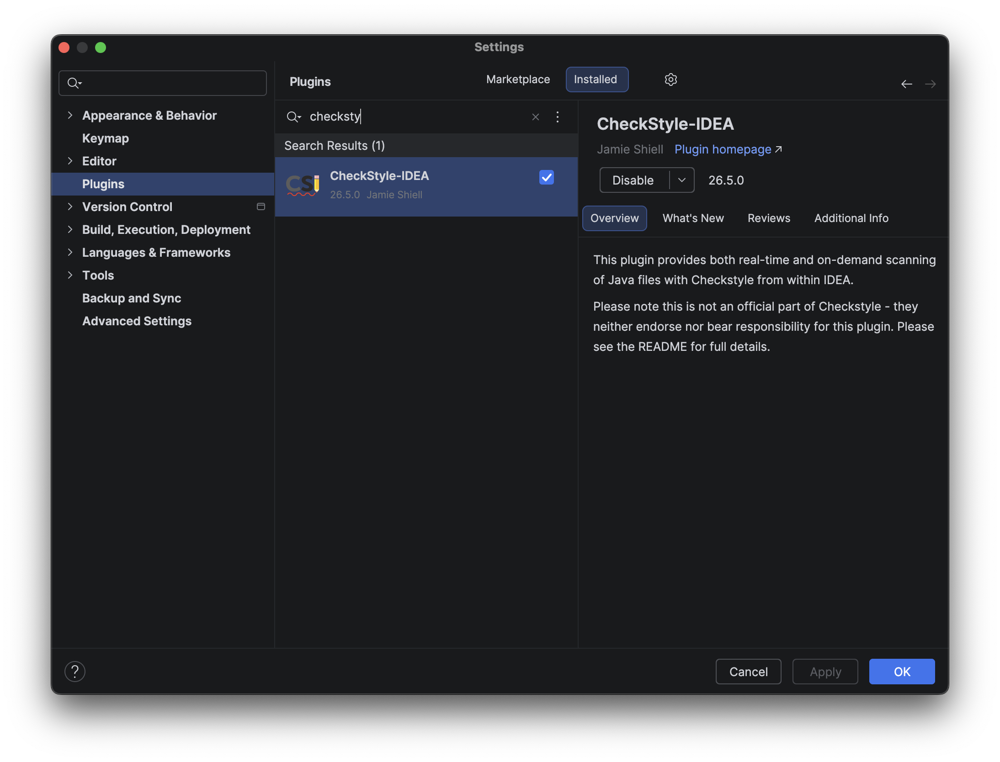
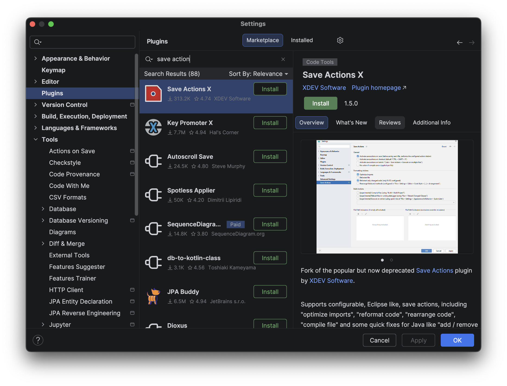
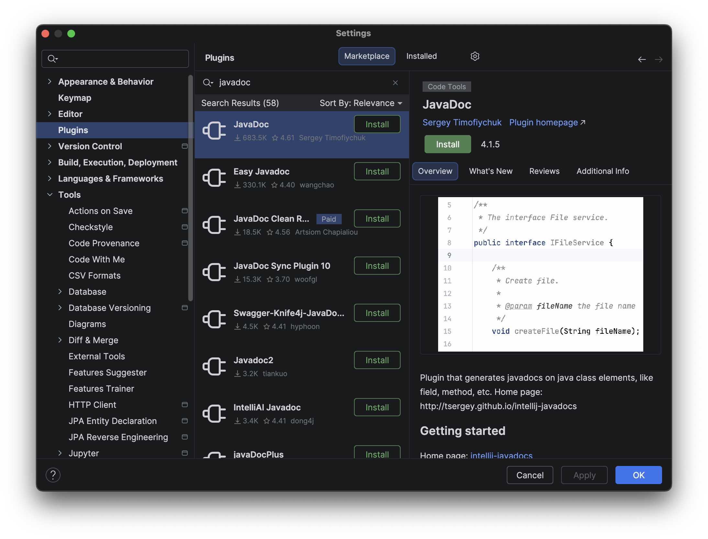
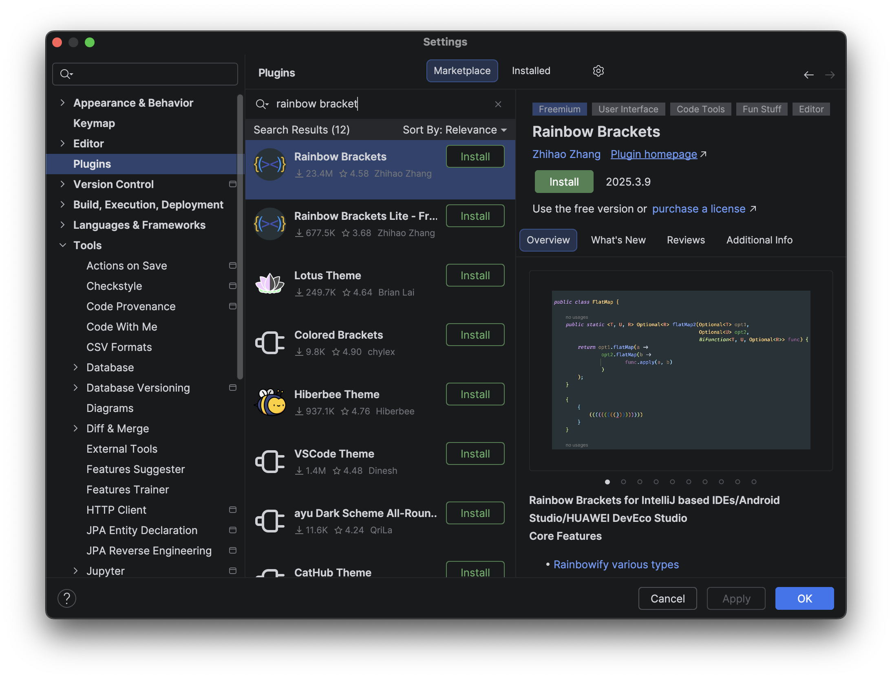
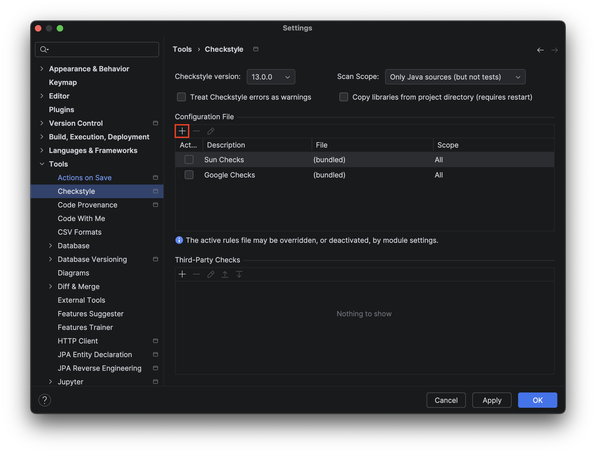
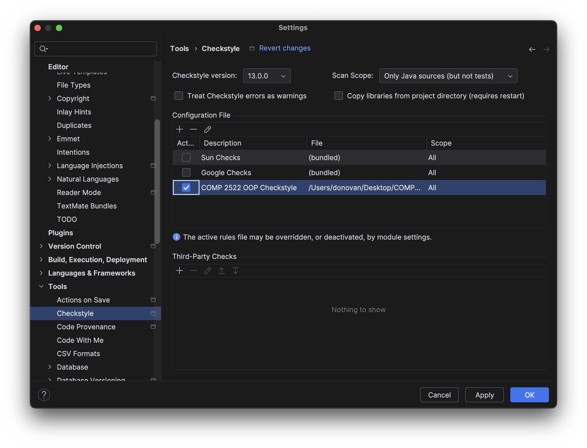
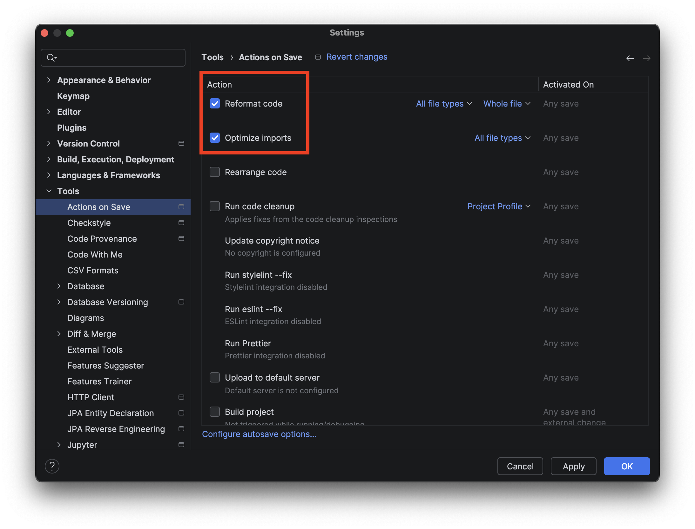

# Installing and Configuring Plugins

## Overview

Plugins extend IntelliJ IDEA's built-in functionality. While IDEA includes
strong support for Java and Kotlin out of the box, several plugins will
improve your experience in CST courses — automating repetitive formatting
tasks, enforcing documentation standards, running course-required style
checks, and helping you build keyboard shortcut habits as you work.

This section covers the plugins recommended for CST students, explains what
each one does, and walks you through installing and configuring them.

By the end of this section, the recommended plugins will be installed and
active globally across all your IntelliJ IDEA projects.

!!! note
    Plugins apply to every project you open in IntelliJ IDEA. If you
    enabled Settings Sync in
    [Installation and Student Account Setup](installation.md), installing
    a plugin on one device will make it available on all your synced
    devices automatically.

## Disabling AI and Code Completion Plugins

!!! warning
    AI-assisted code completion tools are **not permitted** in CST
    coursework. IntelliJ IDEA Ultimate installs the **JetBrains AI
    Assistant** plugin automatically, and may suggest other AI completion
    tools during setup. Disable these before writing any assignment code.

### Disabling the JetBrains AI Assistant Plugin

=== "Windows"

    1. Open **File > Settings** (++ctrl+alt+s++).

=== "macOS"

    1. Open **IntelliJ IDEA > Settings** (++cmd+comma++).

2. Select **Plugins** from the left panel.

3. Click the **Installed** tab.

4. Search for `AI Assistant` in the search field.

5. Uncheck the checkbox next to **AI Assistant** to disable it.

6. Click **OK** and restart IntelliJ IDEA when prompted.

    { alt="Animation showing how to find and disable the JetBrains AI Assistant plugin" title="Disabling the AI Assistant plugin" }

    At this point, the AI Assistant is disabled and will not offer
    code suggestions or completions.

### Disabling Full Line Code Completion

IntelliJ IDEA also has a built-in **Full Line Code Completion** feature
that is separate from the AI Assistant plugin and must also be turned off.

!!! note
    Basic code completion — where IntelliJ suggests method names,
    variable names, and class names as you type — is permitted and
    useful. Only AI-powered and full-line completion tools need to
    be disabled.

=== "Windows"

    1. Open **File > Settings** (++ctrl+alt+s++).

=== "macOS"

    1. Open **IntelliJ IDEA > Settings** (++cmd+comma++).

2. Navigate to **Editor > General > Inline Completion**.

3. Uncheck **Enable full line code completion**.

4. Click **Apply** then **OK**.

## Recommended Plugins for CST Students

| Plugin | Purpose |
|---|---|
| [CheckStyle-IDEA](https://plugins.jetbrains.com/plugin/1065-checkstyle-idea) | Runs the course Checkstyle ruleset against your code and reports violations in a dedicated panel |
| [Save Actions X](https://plugins.jetbrains.com/plugin/22113-save-actions-x) | Automatically reformats code and organizes imports every time you save a file |
| [JavaDoc](https://plugins.jetbrains.com/plugin/7157-javadoc) | Generates Javadoc comment stubs for classes, methods, and fields with a single shortcut |
| [GitToolBox](https://plugins.jetbrains.com/plugin/7499-gittoolbox) | Displays inline Git blame annotations and branch status directly in the editor |
| [Rainbow Brackets](https://plugins.jetbrains.com/plugin/10080-rainbow-brackets) | Colours matching bracket pairs to make nested code easier to read |
| [Key Promoter X](https://plugins.jetbrains.com/plugin/9792-key-promoter-x) | Displays the keyboard shortcut for any action you perform with the mouse, helping you learn shortcuts as you work |

Click any image below to see how each plugin appears in the Marketplace
before installing:

<div class="grid cards" markdown>

- { alt="CheckStyle-IDEA plugin page in the JetBrains Marketplace" title="CheckStyle-IDEA" }
- { alt="Save Actions X plugin page in the JetBrains Marketplace" title="Save Actions X" }
- { alt="JavaDoc plugin page in the JetBrains Marketplace" title="JavaDoc" }
- { alt="GitToolBox plugin page in the JetBrains Marketplace" title="GitToolBox" }
- { alt="Rainbow Brackets plugin page in the JetBrains Marketplace" title="Rainbow Brackets" }
- { alt="Key Promoter X plugin page in the JetBrains Marketplace" title="Key Promoter X" }

</div>

## Installing a Plugin

The steps below apply to any plugin. Use them to install each plugin in
the table above.

!!! tip
    Install all recommended plugins before restarting. You can queue
    multiple installs and restart once to apply them all at the same time.

=== "Windows"

    1. Open **File > Settings** (++ctrl+alt+s++).

=== "macOS"

    1. Open **IntelliJ IDEA > Settings** (++cmd+comma++).

2. Select **Plugins** from the left panel.

3. Click the **Marketplace** tab at the top of the Plugins panel.

4. **Type** the name of the plugin in the search field.

5. Click **Install** next to the plugin name in the search results.

    At this point, IntelliJ IDEA will download and install the plugin.
    A progress bar will appear while the download completes.

6. Click **OK** when prompted to restart IntelliJ IDEA.

    At this point, the IDE will restart and the plugin will be active
    across all your projects.

## Configuring CheckStyle-IDEA

### What Checkstyle Does

IntelliJ IDEA's built-in inspections give you live feedback as you type —
the red and yellow underlines you see in the editor. Checkstyle is a
separate tool that does something different: it runs a precise, shared
ruleset against your finished code and reports any violations in its own
panel.

This distinction matters because your instructors use Checkstyle to grade
your submissions. When your instructor runs the course Checkstyle XML
against your code, they see exactly the same results you do locally — which
means a clean Checkstyle run before you submit is a reliable signal that
your code meets the style requirements.

In short: use IntelliJ inspections to catch issues early while you write.
Use Checkstyle as the final check before submission.

!!! warning
    Checkstyle does not produce live underlines as you type — it only runs
    when you ask it to. Do not assume a clean editor means a clean
    Checkstyle run. Always check the Checkstyle panel before submitting.

### Loading the Course Checkstyle Configuration

Your instructor provides a Checkstyle XML configuration file with each
course lab template. You need to load this file into the CheckStyle-IDEA
plugin so it runs the correct rules.

!!! tip
    Save `COMP-2522-Checkstyle.xml` somewhere it will not be accidentally
    deleted — a dedicated folder such as `Documents/BCIT/IDE_Config` works
    well. IntelliJ IDEA needs to reference this file path each time
    Checkstyle runs.

1. Obtain the `COMP-2522-Checkstyle.xml` file from your course lab
   repository, or download it from the
   [`/resources`](https://github.com/KJAlloway/COMM2216_User_Documentation_Project_KJA_DLN/tree/main/resources)
   folder of this guide.

=== "Windows"

    2. Open **File > Settings** (++ctrl+alt+s++).

=== "macOS"

    2. Open **IntelliJ IDEA > Settings** (++cmd+comma++).

3. Navigate to **Tools > Checkstyle** in the left panel.

4. Under **Configuration File**, click the **+** button to add a new
   configuration.

5. In the dialog that opens, select **Use a local Checkstyle file**.

6. Click **Browse** and navigate to your `COMP-2522-Checkstyle.xml` file.

7. Give the configuration a description, such as `COMP 2522`, and
   click **Next**.

8. Click **Finish**, then check the box next to your new configuration
   to make it active.

9. Click **OK** to save and close.

    At this point, the Checkstyle panel at the bottom of the IDE will
    use the course configuration when it runs.

    { alt="Checkstyle settings panel showing the + button hovered with Add tooltip visible" title="Adding a Checkstyle configuration" }

### Confirming the Scan Scope

After loading the configuration, confirm it will run against your entire
project rather than a limited scope.

=== "Windows"

    1. Open **File > Settings** (++ctrl+alt+s++).

=== "macOS"

    1. Open **IntelliJ IDEA > Settings** (++cmd+comma++).

2. Navigate to **Tools > Checkstyle**.

3. Locate the **Scan Scope** dropdown and confirm it is set to
   **All files** or your preferred scope.

    { alt="Checkstyle settings panel with the Scan Scope dropdown visible" title="Confirming Checkstyle scan scope" }

    The Checkstyle configuration is stored globally in your IDE settings —
    you do not need to repeat the loading steps for each new project.

### Running Checkstyle

Once configured, you can run Checkstyle against your code at any time
from the Checkstyle tool window.

1. Open the Checkstyle tool window by clicking **Checkstyle** in the
   bottom toolbar, or navigate to **View > Tool Windows > Checkstyle**.

2. In the Checkstyle panel, click the **Check Current File** button
   (the green play icon) to run against the file you have open.

    Alternatively, click **Check Project** to run against all files
    in your project.

    At this point, any violations will appear as a list in the
    Checkstyle panel. Each entry shows the rule that was violated,
    the line number, and a description.

3. **Double-click** any violation in the list to jump directly to
   that line in the editor.

!!! tip
    Run **Check Current File** frequently as you work, not just before
    submission. Fixing one violation at a time is much faster than
    addressing a long list at the end.

### Common Checkstyle Violations in COMP 2522

| Violation | Cause | Fix |
|---|---|---|
| Missing Javadoc | A public class, method, or field is missing a Javadoc comment | Add a `/** */` comment with required tags above the element |
| Missing `@author` or `@version` | Class Javadoc exists but is missing required tags | Add `@author YourName` and `@version 1.0` to the class comment |
| Magic number | A numeric literal is used directly instead of a named constant | Assign the value to a `static final` constant and use the constant name |
| Line too long | A line exceeds 100 characters | Break the line using **Reformat Code** (++ctrl+l++ on Windows, ++cmd+opt+l++ on macOS) |
| Unused import | An import statement is present but not used in the file | Remove it, or use Save Actions X to remove it automatically on save |
| Trailing whitespace | A line ends with one or more spaces | Enable **Trim trailing whitespace** in Save Actions X settings |
| Missing `final` on parameter | A method parameter is not declared `final` | Add the `final` keyword before each parameter type |

## Configuring Save Actions X

Save Actions X automatically cleans up your file every time you save.
For CST coursework, the most useful actions are reformatting your code,
removing unused imports, and trimming trailing whitespace — all things
that Checkstyle checks and that are easy to forget to do manually.

!!! warning
    Save Actions X modifies your file on every save. If you are working
    in a shared repository, confirm with your team that everyone is using
    the same code style settings before enabling reformatting, to avoid
    noisy diffs.

=== "Windows"

    1. Open **File > Settings** (++ctrl+alt+s++).

=== "macOS"

    1. Open **IntelliJ IDEA > Settings** (++cmd+comma++).

2. Navigate to **Tools > Actions on Save** in the left panel.

3. Enable the following actions:

    - **Reformat code** — applies your code style settings to the
      entire file on every save
    - **Optimize imports** — removes unused imports and organizes
      import statements according to your code style settings

    { alt="Tools > Actions on Save panel showing Reformat code and Optimize imports checkboxes enabled" title="Configuring Actions on Save" }

4. Click **OK** to save and close.

    At this point, every time you press ++ctrl+s++ (Windows) or
    ++cmd+s++ (macOS) — or the IDE autosaves — your file will be
    automatically reformatted and its imports cleaned up.

!!! tip
    Save Actions X uses the code style settings configured at
    **File > Settings > Editor > Code Style**. If you have imported
    the CST inspection profile from
    [Configuring Inspections](inspections.md), your formatting will
    already match course style requirements.

## Configuring the JavaDoc Plugin

The JavaDoc plugin generates comment stubs for classes, methods, and
fields based on their signatures. Instead of typing `@param`, `@return`,
and `@throws` tags manually, the plugin inserts the structure for you and
leaves the descriptions blank for you to fill in.

In CST courses, complete Javadoc comments are required for all submitted
code. This plugin significantly reduces the time it takes to document
your work correctly.

### Configuring the Class-Level Template

By default, the JavaDoc plugin's class-level template does not include
`@author` or `@version` tags. Update the template here so that generated
class comments include them automatically.

=== "Windows"

    1. Open **File > Settings** (++ctrl+alt+s++).

=== "macOS"

    1. Open **IntelliJ IDEA > Settings** (++cmd+comma++).

2. Navigate to **Tools > JavaDoc** in the left panel.

3. Click the **Templates** tab.

4. Select **Class level** from the template list.

    At this point, you will see four template fields. Replace all four
    with the following:

    ```
    /**
     * @author Your Name
     * @version X.X
     */
    ```

5. Click **Apply** then **OK**.

    At this point, any class-level Javadoc generated by the plugin will
    include the `@author` and `@version` tags ready for you to fill in.

### Generating Javadoc for a Selected Element

1. Place your caret on the class, method, or field you want to document.

2. Press ++alt+insert++ (Windows) or ++cmd+n++ (macOS) to open the **Generate** menu.

3. Select **Generate JavaDocs for selected element**.

    At this point, a Javadoc comment stub is inserted directly above the
    element. It includes `@param` tags for each parameter, a `@return`
    tag if the method returns a value, and `@throws` tags for any
    declared exceptions.

4. Fill in the description text for each tag.

### Generating Javadoc for an Entire File

1. Open the file you want to document.

2. Press ++ctrl+shift+a++ (Windows) or ++cmd+shift+a++ (macOS) to open **Find Action**.

3. Type `Generate JavaDocs for all elements` and press ++enter++.

    At this point, stubs are inserted for every undocumented class,
    method, and field in the file.

!!! note
    The JavaDoc plugin only generates stubs — it does not write
    descriptions for you. You are responsible for filling in meaningful
    content for each tag. Javadoc comments with empty or placeholder
    descriptions will not satisfy course requirements.

## Configuring Key Promoter X and Rainbow Brackets

Key Promoter X and Rainbow Brackets require no configuration beyond
installation. Once installed they are active immediately.

**Key Promoter X** is accessible under **File > Settings > Tools >
Key Promoter X** if you want to adjust how often it shows popups.
The **Suppress count** value controls how many times you can perform
an action with the mouse before Key Promoter X stops reminding you
about its shortcut.

**Rainbow Brackets** has its own settings tab under
**File > Settings > Rainbow Brackets** where you can customize colours
if desired, but the defaults work well out of the box.

## Conclusion

Your recommended plugins are now installed and configured globally across
all your IntelliJ IDEA projects. AI completion is disabled to comply with
course requirements. CheckStyle-IDEA will let you run the course Checkstyle
configuration before every submission. Save Actions X will keep your code
formatted and your imports clean automatically. The JavaDoc plugin will
reduce the time it takes to document your work.
