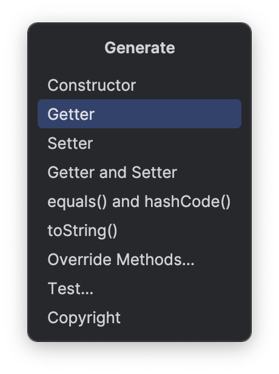
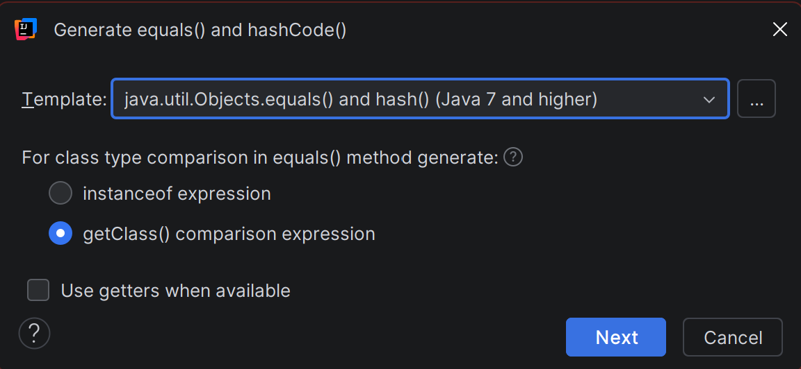

# Configuring Code Templates

## Overview

IntelliJ IDEA can automatically generate common Java methods for you —
`equals()`, `hashCode()`, and `toString()` — so you do not have to write
them from scratch every time. It does this using templates that define
what the generated code should look like.

The default templates do not match COMP 2522 style requirements, so this
section walks you through replacing them with course-compliant versions.
Once set up, every time you generate these methods IntelliJ will produce
code that already follows your instructor's standards.

This section also covers updating the [Javadoc](glossary.md#javadoc) plugin's
class comment template so that generated class headers automatically include
the `@author` and `@version` tags your instructor requires.

!!! note
    It is okay if some of the template code below looks unfamiliar — you
    are not expected to understand every line of it yet. The goal right
    now is to get your environment set up correctly so these tools work
    for you throughout the term. If you encounter terms you don't
    recognize, make a note and ask your instructor.

!!! note
    These templates are stored globally in your IDE settings and apply to
    every project you open. You only need to configure them once.

!!! note
    Template configuration is accessed through the Generate menu inside
    an open Java class file. Before starting, open any `.java` file in
    your project — any existing class works fine.

## Configuring the toString Template

The `toString()` method produces a readable text description of an object —
useful for debugging and logging. The template below checks what fields are
present in your class and builds them into a consistent output format,
while also checking for a [superclass](glossary.md#superclass) and including
its information if one exists.

1. Open any Java class file in your project.

2. Press ++alt+insert++ to open the **Generate** menu.

    { alt="IntelliJ IDEA Generate menu showing options including toString(), equals() and hashCode(), and JavaDocs" title="The Generate menu" }

3. Select **toString()**.

    At this point, the **Generate toString()** dialog opens showing
    your class fields.

4. Click the **...** button beside the **Template** dropdown in the
   top-right area of the dialog.

5. Click the **Templates** tab.

6. Select the existing template and click **Edit**, or click **Add** to
   create a new one named `COMP 2522 toString`.

7. Replace the entire template contents with the following:

    ```
    public java.lang.String toString() {
    final java.lang.StringBuilder sb;
    sb = new java.lang.StringBuilder("$classname{");
    #if ($parentClassName != "Object")
    sb.append("super=").append(super.toString());
        #set ($i = 1)
    #else
        #set ($i = 0)
    #end
    #foreach ($member in $members)
        #if ($i == 0)
        sb.append("##
        #else
        sb.append(", ##
        #end
        #if ($member.string)
            $member.name='")##
        #else
            $member.name=")##
        #end
        #if ($member.primitiveArray || $member.objectArray)
        .append(java.util.Arrays.toString($member.name));
        #elseif ($member.string)
        .append($member.accessor).append('\'');
        #else
        .append($member.accessor);
        #end
        #set ($i = $i + 1)
    #end
    sb.append('}');
    return sb.toString();
    }
    ```

    The animation below shows the full flow from opening the dialog
    to saving the completed template:

    { alt="Animation demonstrating how to open the toString generation dialog, access the template settings, and replace the template with the COMP 2522 version" title="Replacing the toString template" }

8. Click **OK** to save the template.

9. Back in the toString() Settings dialog, select your updated template
   from the **Template** dropdown to make it active.

10. Click **OK** to close the settings dialog, then **OK** again in the
    Generate toString() dialog to generate the method and verify the output.

!!! tip
    The same template system works for anything in the Generate menu —
    if you find yourself writing the same code structure repeatedly in
    this course, you can save it as a template the same way. You can
    also look into **Live Templates** (**File > Settings > Editor >
    Live Templates**) which let you type a short abbreviation like
    `tostr` and have IntelliJ expand it into the full method body
    instantly, without opening the Generate menu at all.

## Configuring the equals and hashCode Templates

The `equals()` method checks whether two objects are meaningfully the same.
The template below looks at each field in your class and compares them one
by one, while also checking that the two objects are exactly the same type
before comparing anything. The `hashCode()` method works alongside `equals()`
— Java requires that if two objects are equal, they must produce the same
hash code, so these are always configured together.

1. Press ++alt+insert++ to open the **Generate** menu again.

2. Select **equals() and hashCode()**.

    { alt="IntelliJ IDEA equals() and hashCode() generation dialog showing class fields available for selection" title="The equals() and hashCode() generation dialog" }

    At this point, the **Generate equals() and hashCode()** wizard opens.

3. Click the **...** button beside the **Template** dropdown.

4. Select the existing equals template and click **Edit**, or click
   **Add** to create a new one named `COMP 2522 equals`.

5. Replace the entire equals template contents with the following:

    ```
    #parse("equalsHelper.vm")
    public boolean equals(##
    #if ($settings.generateFinalParameters)
    final ##
    #end
    Object $paramName){
    #addEqualsPrologue()
    #addClassInstance()
    return ##
    #set($i = 0)
    #if($superHasEquals)
    super.equals($paramName) ##
        #set($i = 1)
    #end
    #foreach($field in $fields)
        #if ($i > 0)
        && ##
        #end
        #set($i = $i + 1)
        #if ($field.primitive)
            #if ($field.double || $field.float)
                #addDoubleFieldComparisonConditionDirect($field) ##
            #else
                #addPrimitiveFieldComparisonConditionDirect($field) ##
            #end
        #elseif ($field.enum)
            #addPrimitiveFieldComparisonConditionDirect($field) ##
        #elseif ($field.array)
        java.util.Objects.deepEquals($field.accessor, ${classInstanceName}.$field.accessor)##
        #else
        java.util.Objects.equals($field.accessor, ${classInstanceName}.$field.accessor)##
        #end
    #end
    ;
    }
    ```

6. Click **OK** to save the equals template.

7. Select the hashCode template entry and click **Edit**, or click
   **Add** to create a new one named `COMP 2522 hashCode`.

8. Replace the entire hashCode template contents with the following:

    ```
    public int hashCode() {
    #if (!$superHasHashCode && $fields.size()==1)
        #if (!$fields[0].array)
        return java.util.Objects.hashCode($fields[0].accessor);
        #elseif ($fields[0].nestedArray)
        return java.util.Arrays.deepHashCode($fields[0].accessor);
        #else
        return java.util.Arrays.hashCode($fields[0].accessor);
        #end
    #else
    return java.util.Objects.hash(##
        #set($i = 0)
        #if($superHasHashCode)
        super.hashCode() ##
            #set($i = 1)
        #end
        #foreach($field in $fields)
            #if ($i > 0)
            , ##
            #end
            #if(!$field.array)
                $field.accessor ##
            #elseif ($field.nestedArray)
            java.util.Arrays.deepHashCode($field.accessor)##
            #else
            java.util.Arrays.hashCode($field.accessor)##
            #end
            #set($i = $i + 1)
        #end
    );
    #end
    }
    ```

9. Click **OK** to save the hashCode template.

10. Back in the equals() and hashCode() wizard, select your updated
    templates from the dropdowns and click **Next** to select the fields
    to include.

11. Click **Finish** to generate the methods.

## Configuring the Javadoc Class Template

The JavaDoc plugin's default class comment template does not include
`@author` or `@version` tags. Updating it here means every class comment
you generate will already have those tags waiting for you to fill in —
no more forgetting them before submission.

Unlike the `toString` and `equals` templates, this one is configured
through **Settings** rather than the Generate menu.

1. Open **File > Settings** (++ctrl+alt+s++).

2. Navigate to **Tools > JavaDoc** in the left panel.

3. Click the **Templates** tab.

4. Select **Class level** from the template list.

5. Replace all four template fields with the following:

    ```
    /**
     * @author Your Name
     * @version X.X
     */
    ```

6. Click **Apply** then **OK**.

    At this point, any class-level Javadoc generated by the plugin will
    include the `@author` and `@version` tags ready for you to fill in.

## Conclusion

Your code generation templates are now configured for COMP 2522. From here,
using **Generate** (++alt+insert++) on any class will produce compliant
`equals()`, `hashCode()`, `toString()`, and Javadoc comments automatically.

This is the last configuration step in the guide. Your environment is now
fully set up for CST coursework — the work you have done here will save you
time and help you avoid style penalties on every assignment this term.
